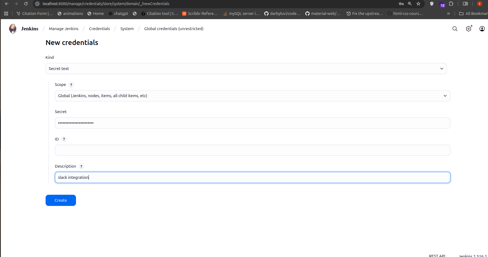

# Project Deployment and CI/CD Documentation

This README documents the steps completed so far for deploying and automating this application, including cloud database setup, Jenkins pipeline configuration, and deployment to Render. Screenshots can be attached to illustrate key steps.

---

# Milestone 1: Set Up Cloud Database

1.Fork and Clone Repository
- Fork the repository from GitHub.
- Clone it locally:

git clone https://github.com/Vusena/gallery.git
cd gallery

2.Set Up MongoDB Atlas
Navigate to MongoDB Atlas

-Create a free cluster.
-Create a database user with a username and password.
-Update the _config.js file in your project:

## config.mongoURI = {
    production: 'mongodb+srv://vusena:Tuesday@20@gallery.wc344.mongodb.net/darkroom?retryWrites=true&w=majority',
    development: 'mongodb+srv://vusena:Tuesday@20@gallery.wc344.mongodb.net/darkroom-dev?retryWrites=true&w=majority',
    test: 'mongodb+srv://vusena:Tuesday@20@gallery.wc344.mongodb.net/darkroom-test?retryWrites=true&w=majority',
}
module.exports = config;

3.Configure Jenkins Pipeline

-Create a new job:
--Type: Pipeline
--Source: Git repository URL
--Branch: master
--Enable GitHub hook trigger for GITScm polling.
--Test webhook integration.

4.Using ngrok

-Expose Jenkins locally so GitHub can reach it:
-Use the ngrok URL as your webhook URL in GitHub:

5. Fixing Server Binding

-Ensure the server binds to 0.0.0.0 to allow Render and other services to access it:
app.listen(PORT, '0.0.0.0', () => {
console.log(`Server running on port ${PORT}`);
});

6. Pipeline Verification and Deployment
-Trigger the Jenkins pipeline via GitHub push → Jenkins → Render flow.
-Verify Node and NPM versions.
-Jenkins runs the pipeline, deploys to Render, and the updated site shows Milestone 2.
 
7. The application is currently running at:
### https://gallery-7ss6.onrender.com/

<!-- Other Screenshots -->

8. Configure Jenkins to Use the Slack App:

-In Jenkins, go to Manage Jenkins → Configure System.
-Scroll down to the Slack section.
-Enter your Slack workspace's subdomain in the Team Subdomain field.
-Under Integration Token Credential ID, click Add → Jenkins → Secret text.
-Paste the Bot User OAuth Access Token into the Secret field and give it an ID (e.g., slack-token).
-Select the newly created credential in the dropdown.
-Specify the default Slack channel (e.g., #jenkins-notifications).
-Click Test Connection to ensure Jenkins can communicate with Slack.
-Click Save to apply the changes.

Add Slack Notifications to Your Jenkins Pipeline:
In your Jenkins pipeline script, use the slackSend step to send messages to Slack

post {
success {
slackSend(
channel: "#jenkins-notifications",
color: "good",
message: "Build SUCCESS!\nBuild ID: ${env.BUILD_NUMBER}\nMore info: ${env.BUILD_URL}"
)
}
failure {
slackSend(
channel: "#jenkins-notifications",
color: "danger",
message: "Build FAILED!\nBuild ID: ${env.BUILD_NUMBER}\nMore info: ${env.BUILD_URL}"
)
}
}

refer to this screensots

###
This is the final look of my application
